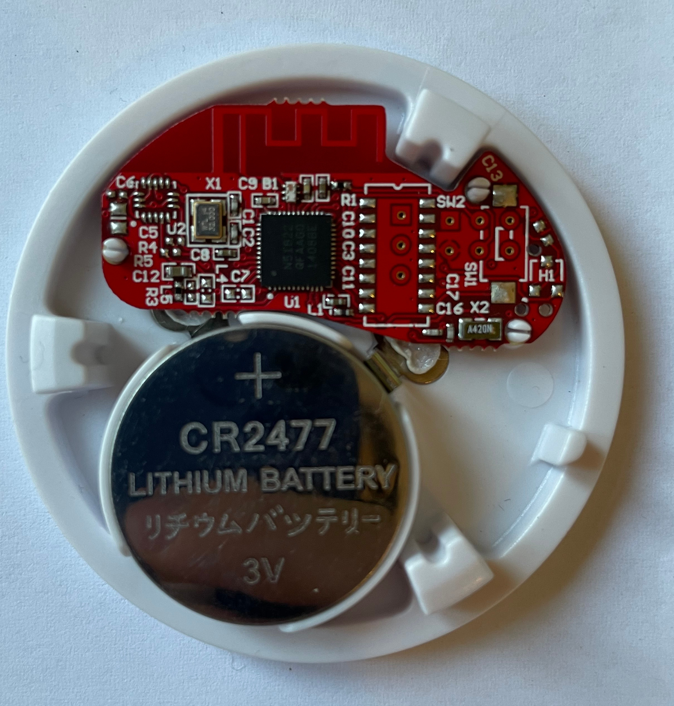

# BTHome Sensor Zephyr

This project contains the code to enable any BLE capable microcontroller to act as a [BTHome](https://bthome.io) sensor using the Zephyr RTOS. The goal is to create a low-power device which reads sensor data (temperature, energy, pressure, etc.), which will be published at a regular interval. This can in the end be used by any BTHome compatible listener, for example [Home Assistant](https://www.home-assistant.io).

Requirements
************

* A board with BLE support
* A BTHome compatible listener with the BTHome integration running.

Building and Running
********************
When the sample is running, navigate to Devices & Services under settings in Home
Assistant. There you will be asked to configure the BTHome sensor if everything
went well.

## Project Idea
The whole project idea started when I set up my first Home Assistant server on a Raspberry Pi. I quickly learned, that there are multiple methods to integrate sensors and actuators into this home automation framework. An easy way seems to be the BTHome protocol, which basically uses the capability of BLE devices to publish data during advertisement. This is perfect for energy effecient sensor nodes, as the MCU can sleep most of the time and therefore save energy.

The perfect hardware for such a sensor node would be a small, battery powered MCU with BLE support. Luckily, I has a few BLE beacons laying around which were used for an old project a few years ago. All in all it seemed like a quick and easy project :D The fact that they used an old and outdated MCU by Nordic Semiconductors and a special hardware layout made the project not so quick and easy. But more about that later.

## Reverse engineering the iBKS 105
The iBKS 105 is a Bluetooth Low Energy (BLE) beacon based on Nordic Semiconductors NRF51822 chipset that uses a CR2477 coin cell battery.



Reviewing the PCB inside the beacon seemed very promising as a few pins of the MCU have been faned out to a connector of some sort which is not populated. Additionally, there are also some pins of the MCU mapped to a few through-hole pads and SMT pads. Interestingly, the part *U2* is also not populated, but we will focus on the available GPIO on the pads which we could use in multiple ways to connect to sensors, actuators, you name it.

A few minutes poking around with a multimeter revealed, that 13 GPIOs of the NRF51822 are available for us. One of those seems to be a push button *(GPIO7)* and another seems to be the input to a MOSFET *(GPIO6)* which could be used to switch higher loads, for example actuators. On the back side the board conveniently also features a TagConnect TC2030 debugging header. The pinout of this header is custom to this board, so please be aware of that.


The board also features a LFXO *X2* (low-frequency crystal oscilllator), which is great news for low-power applications. The HFXO  *X1* is a **32 MHz !!!** crystal. This is was I mentioned before and took me hours debugging. The NRF51 architecture has a 16 MHz internal clock. Normally (in all other boards I found) a 16 MHz external HFXO is used. I think, as this design is very small and dense, the 32 MHz crystal, which has a smaller form factor is therefore used. Unfortunatelly, all existing code I tried did not work when using the RF section of the chip. The much more accurate external HFXO (20 ppm drift) is only used when the RF section is activated, as this has strict timing requirements and therefore it did not work.

After hours of debugging I finally found the solution in the [Nordic Forum](https://devzone.nordicsemi.com/f/nordic-q-a/6394/use-external-32mhz-crystal). What you basically have to do to get the chip working with an external 32 MHz clock is two things.

1. Write a specific section in the UICR
2. Set the frequency in the *NRF_CLOCK* register

This small section of code does both things and has to be executed once before the RF section is used.

```cpp

  // Write UICR section
  *(uint32_t *)0x10001008 = 0xFFFFFF00;

  // Set the external high frequency clock source to 32 MHz
  NRF_CLOCK->XTALFREQ = 0xFFFFFF00;

  // Start the external high frequency crystal
  NRF_CLOCK->EVENTS_HFCLKSTARTED = 0;
  NRF_CLOCK->TASKS_HFCLKSTART = 1;

  // Wait for the external oscillator to start up
  while (NRF_CLOCK->EVENTS_HFCLKSTARTED == 0) {}
```

And voilà, BLE finally works on the NRF51 😁

## Manufacturer firmware download iBKS 105
Who knows if I may use these boards again in the future as beacons. Therefore, I wanted to extract the manufacturer firmware of the iBKS boards. Should be a simple task with a DAPLink programmer, a TagConnect cable and OpenOCD. I quickly wrote an openocd script

```bash
# Start OpenOCD with DAPLink and nRF51 target
openocd -f interface/cmsis-dap.cfg -f target/nrf51.cfg

# In a new terminal, start Telnet session:
telnet localhost 4444

# Halt the target
halt

# Dump firmware from flash memory (e.g., 128 KB)
dump_image firmware.bin 0x00000000 0x20000

# Exit Telnet
exit

```

To my surprise, I got a binary file with all zeros

```
00000000: 00 00 00 00 00 00 00 00 00 00 00 00 00 00 00 00  ................
00000010: 00 00 00 00 00 00 00 00 00 00 00 00 00 00 00 00  ................
00000020: 00 00 00 00 00 00 00 00 00 00 00 00 00 00 00 00  ................
00000030: 00 00 00 00 00 00 00 00 00 00 00 00 00 00 00 00  ................
.
.
.
```

After a bit of reserach I found out that the firmware of this device seems to be locked. :/ What a bummer...
Luckily, a little bit later I found an arcticle from 2020 by Loren Browman called [Automated Unlocking of nRF51 Series SoCs with nrfsec](https://www.optiv.com/insights/discover/blog/automated-unlocking-nrf51-series-socs-nrfsec "Automated Unlocking of nRF51 Series SoCs with nrfsec"). A very brief description of this article is that the debug interface of the NRF51 series always allows a full memory dump, even if read back protection is enabled. Loren wrote a wonderful little tool called [nrfsec](https://github.com/buildxyz-git/nrfsec) which makes it very easy to read the protected firmware. (Unfortunately it only works with a ST-Link debug probe)

```bash
nrfsec read -a
```

After a few minutes you get all the content of the MCU in a folder called *fw*.

```bash
├── fw
│   ├── 0x00000000_0x00040000_ROM.bin
│   ├── 0x10000000_0x10000400_FICR.bin
│   ├── 0x10001000_0x10001400_UICR.bin
│   ├── 0x20000000_0x20004000_RAM.bin
│   ├── 0x40000000_0x40020000_PERIPH.bin
│   └── 0x50000000_0x50001000_GPIO.bin

```

To restore the macufacturer firmware all one has to do is execute

```bash
nrfsec restore
```

So thank you very much Loren for saving me a lot of trouble. Please do read the full article as he explains how it works in detail. Very fascinating stuff :)

